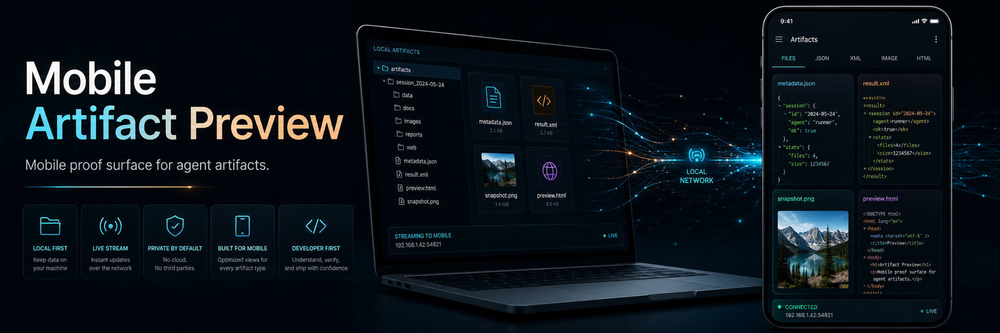
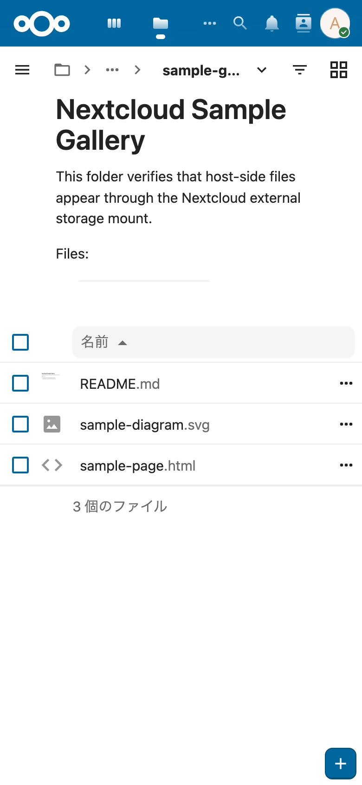
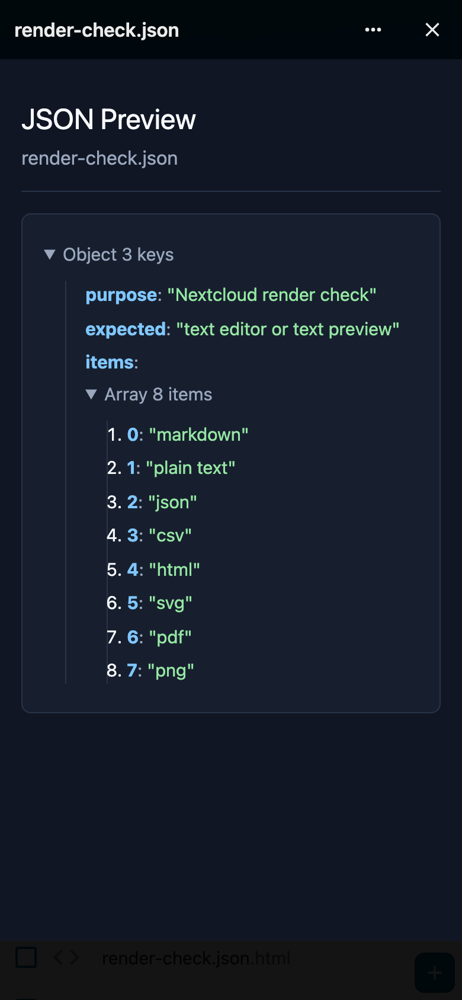
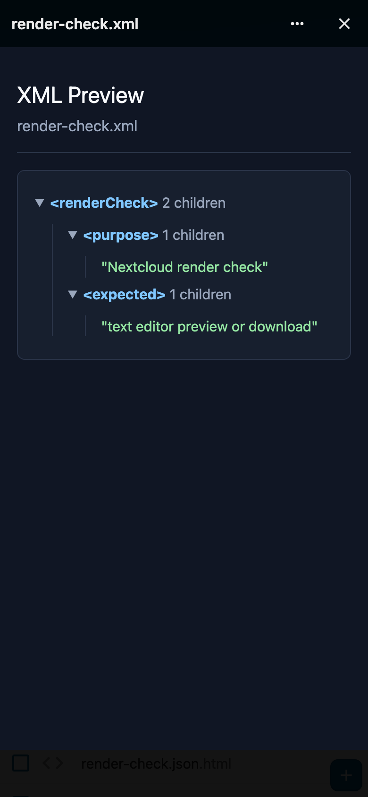
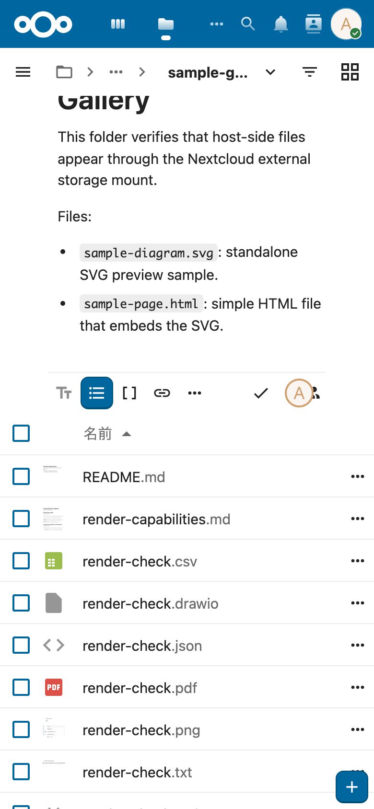
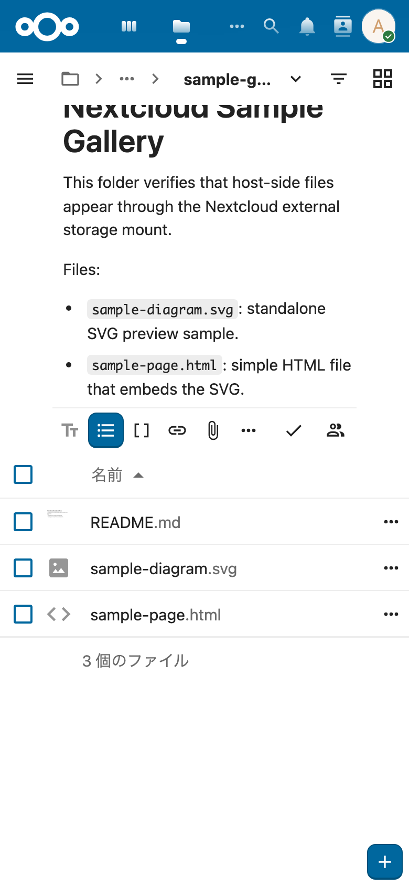

# Mobile Artifact Preview

[English README](README.md)

<p align="center">
  
</p>

[](https://github.com/Sunwood-ai-labs/mobile-artifact-preview/actions/workflows/validate.yml)
[](LICENSE)

Codex やエージェントが作った生成物を、スマホやタブレットから確認するための
スキルと LAN ビューアの一括パッケージです。

画像、スクリーンショット、HTML、SVG、JSON、XML、PDF、draw.io export、
レポートなどを作ったときに、ローカルパスだけで終わらせず、モバイルで開ける
リンク、ローカル fallback、表示確認の証拠を返すために使います。

## 何を解決するか

エージェントは便利なファイルを作れますが、モバイルチャット上では見えなかったり、
リンクがなくて確認しづらいことがあります。このパッケージは、ローカルの開発成果物を
スマホ確認できる面に載せます。

- `~/Prj` を `Project` として Nextcloud にマウントします。
- `~/.codex` を `Codex` として Nextcloud にマウントします。
- JSON と XML は構造化されたモバイルプレビューで開きます。
- HTML、SVG、Markdown、画像、PDF は Nextcloud の viewer で確認できます。
- スキル側で、Codex にリンクと検証証拠を返すよう指示します。

## 実表示の証拠

以下のスクリーンショットは、README の装飾ではなく、このリポジトリが狙っている
実際のモバイル表示面の証拠として入れています。

| モバイルファイル一覧 | JSON 構造化表示 | XML 構造化表示 |
| --- | --- | --- |
|  |  |  |

| HTML 表示 | SVG 表示 |
| --- | --- |
|  |  |

## リポジトリ構成

```text
SKILL.md
agents/openai.yaml

assets/nextcloud-file-viewer/
  compose.yaml
  setup-external-storage.sh
  apps/structuredviewer/
  scripts/render-structured-previews.mjs

docs/images/
  README で使う代表的なモバイル検証スクショ
```

ランタイムデータ、全量の evidence、生成された重いサンプルバイナリは除外しています。
README で意味のある小さなスクショだけを残しています。

## スキルのインストール

```bash
./scripts/install-skill.sh
```

このリポジトリをスキルとしてインストールする先:

```text
~/.codex/skills/mobile-artifact-preview
```

明示的に使う場合:

```text
$mobile-artifact-preview
```

## Nextcloud ビューアの起動

```bash
cd assets/nextcloud-file-viewer
docker compose up -d
./setup-external-storage.sh
```

デフォルトURL:

```text
http://127.0.0.1:8793/
```

デフォルトログイン:

```text
admin / admin
```

LAN やスマホから開く場合は、ホストの LAN IP を trusted domains に入れます。

```bash
NEXTCLOUD_TRUSTED_DOMAINS="localhost 127.0.0.1 192.168.x.x" \
docker compose up -d
```

その後、スマホから以下を開きます。

```text
http://192.168.x.x:8793/
```

## 設定

マウントするフォルダを変える場合:

```bash
MOBILE_ARTIFACT_PROJECTS_DIR=/path/to/projects \
MOBILE_ARTIFACT_CODEX_DIR=/path/to/.codex \
docker compose up -d
```

ポートを変える場合:

```bash
MOBILE_ARTIFACT_NEXTCLOUD_PORT=8893 docker compose up -d
```

初期管理ユーザーを変える場合:

```bash
NEXTCLOUD_ADMIN_USER=admin \
NEXTCLOUD_ADMIN_PASSWORD='change-me' \
docker compose up -d
```

`NEXTCLOUD_ADMIN_USER` を変えた場合は、`setup-external-storage.sh` 実行時にも
同じ値を渡してください。

Markdown プレビューの外観を変える場合:

```bash
docker exec -u www-data agent-nextcloud php occ config:app:set structuredviewer theme --value=branded_dark
docker exec -u www-data agent-nextcloud php occ config:app:set structuredviewer background_image --value='https://example.local/background.png'
docker exec -u www-data agent-nextcloud php occ config:app:set structuredviewer accent --value='#32c7f4'
docker exec -u www-data agent-nextcloud php occ config:app:set structuredviewer highlight --value='#d98545'
```

`background_image` は空文字または `none` で解除できます。一時的に確認したい場合は
URL パラメータでも上書きできます。

```text
?sv_bg=https%3A%2F%2Fexample.local%2Fbackground.png&sv_accent=%235ce1ff
```

Nextcloud 全体の外観も合わせる場合は、`theming` アプリの設定を使います。
ビューア内の Markdown/JSON/XML だけでなく、ファイル一覧やヘッダー側の色、
背景画像まで同じブランドテーマに寄せられます。

```bash
cd assets/nextcloud-file-viewer
MOBILE_ARTIFACT_THEME_BACKGROUND_IMAGE="$PWD/../../docs/images/eclipse-grand-wallpaper.png" \
MOBILE_ARTIFACT_THEME_MOBILE_BACKGROUND_IMAGE="$PWD/../../docs/images/eclipse-mobile-wallpaper.png" \
MOBILE_ARTIFACT_THEME_LOGO_IMAGE="$PWD/../../docs/images/nextcloud-custom-logo.png" \
MOBILE_ARTIFACT_THEME_FAVICON_IMAGE="$PWD/../../docs/images/nextcloud-custom-favicon.png" \
scripts/apply-global-theme.sh
```

主な上書きパラメータ:

```bash
MOBILE_ARTIFACT_THEME_NAME="Mobile Artifact Preview"
MOBILE_ARTIFACT_THEME_SLOGAN="Mobile proof surface for agent artifacts"
MOBILE_ARTIFACT_THEME_COLOR="#0ea5d8"
MOBILE_ARTIFACT_THEME_PRIMARY_COLOR="#0ea5d8"
MOBILE_ARTIFACT_THEME_BACKGROUND_COLOR="#070810"
MOBILE_ARTIFACT_VIEWER_ACCENT="#32c7f4"
MOBILE_ARTIFACT_VIEWER_HIGHLIGHT="#d98545"
MOBILE_ARTIFACT_THEME_BACKGROUND_IMAGE="/path/to/background.png"
MOBILE_ARTIFACT_THEME_MOBILE_BACKGROUND_IMAGE="/path/to/mobile-background.png"
MOBILE_ARTIFACT_THEME_LOGO_IMAGE="/path/to/logo.png"
MOBILE_ARTIFACT_THEME_LOGO_HEADER_IMAGE="/path/to/header-logo.png"
MOBILE_ARTIFACT_THEME_FAVICON_IMAGE="/path/to/favicon.png"
MOBILE_ARTIFACT_THEME_USER="admin"
MOBILE_ARTIFACT_SYNC_USER_THEME="1"
```

背景画像は Nextcloud の「管理設定 -> 外観」から手動で変えることもできますが、
このスクリプトを使うと起動中の検証環境に同じ設定を何度でも再適用できます。
デフォルトでは、`admin` ユーザーに残っている個人背景を解除して、全体テーマの
背景画像が見える状態にします。個人設定を触りたくない場合は
`MOBILE_ARTIFACT_SYNC_USER_THEME=0` を指定してください。
Files/Viewer 画面では、PCや横長画面に `MOBILE_ARTIFACT_THEME_BACKGROUND_IMAGE`、
スマホや縦長画面に `MOBILE_ARTIFACT_THEME_MOBILE_BACKGROUND_IMAGE` を使います。
`MOBILE_ARTIFACT_THEME_LOGO_IMAGE` を指定すると Nextcloud のロゴを差し替えます。
ヘッダー専用ロゴは `MOBILE_ARTIFACT_THEME_LOGO_HEADER_IMAGE`、favicon は
`MOBILE_ARTIFACT_THEME_FAVICON_IMAGE` で個別指定できます。未指定の場合は通常ロゴを
再利用します。
また、Files/Viewer 画面のナビゲーション、ファイル一覧、Dashboard のおすすめ
ファイルカードは半透明のガラス調にして、背景を見せつつ可読性を保ちます。
ガラス効果はセクション単位の1層に限定し、行やおすすめ項目などの子要素は
透明にして、スマホで場所ごとの不透明度がばらつかないようにしています。

デフォルトのカスタムテーマは、エクリプス壁紙から抽出した色をUI向けに調整しています。

```text
background: #070810
primary:    #0ea5d8
accent:     #32c7f4
highlight:  #d98545
```

## モバイルリンクの形

`~/Prj` 配下のフォルダは、次の形でスマホから開けます。

```text
http://<host-ip>:8793/apps/files/files?dir=/Project/<path-under-Prj>
```

例:

```text
http://192.168.x.x:8793/apps/files/files?dir=/Project/nextcloud-file-viewer/sample-gallery
```

## 検証

セットアップ後やパッケージ変更後は以下を確認します。

```bash
./scripts/validate-package.sh
```

実際のモバイル表示確認では、`390x844` のようなスマホサイズ viewport で、
ヘッダーの見切れ、左右のはみ出し、押せないボタン、JSON/XML の構造化表示を確認します。

## セキュリティ

これは LAN 内の開発プレビュー用です。デフォルト認証情報のまま public internet に
Nextcloud ポートを公開しないでください。
