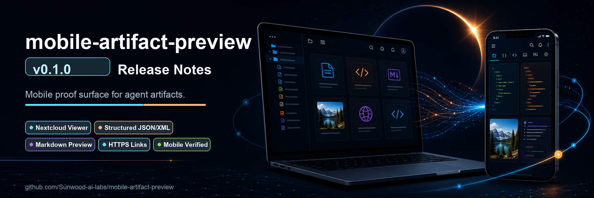

# Mobile Artifact Preview v0.1.0 Release Notes



Release date: 2026-06-07

v0.1.0 is the first public release of Mobile Artifact Preview: a Codex skill plus a small Nextcloud-based preview environment for checking local agent artifacts from a phone or tablet.

This release packages the work needed to move from "the agent made a file" to "the user can open, inspect, and verify that file from mobile".

## ✨ Highlights

- Added the `mobile-artifact-preview` Codex skill as the repository root skill package.
- Bundled a Nextcloud file viewer that mounts local project and Codex folders as `/Project` and `/Codex`.
- Added mobile-first preview support and verification guidance for generated images, screenshots, HTML, SVG, Markdown, JSON, XML, CSV, PDF, draw.io exports, reports, and other local artifacts.
- Standardized the response contract: return a clickable mobile-accessible link, a local fallback path, and the verification surface used.
- Added real mobile evidence screenshots under `docs/images/` so the README documents the actual target surfaces.
- Added a dedicated v0.1.0 release header image aligned with the README visual system.

## 📦 Package And Installation

The release turns the earlier local experiment into a portable skill package:

- Moved the skill definition to the repository root so the repository itself can be installed as `mobile-artifact-preview`.
- Added `scripts/install-skill.sh` for installing the repository into `~/.codex/skills/mobile-artifact-preview`.
- Added `agents/openai.yaml` as the agent entrypoint metadata.
- Added bilingual public README files and repository-level documentation for operators.
- Added a GitHub Actions validation workflow that runs `./scripts/validate-package.sh` on push and pull request.
- Added release QA inventory under `tmp/release-qa-v0.1.0.md`.

## 📱 Nextcloud Mobile Artifact Viewer

The bundled viewer in `assets/nextcloud-file-viewer/` provides a Docker Compose setup for local artifact browsing:

- `~/Prj` is exposed to Nextcloud as `Project`.
- `~/.codex` is exposed as `Codex`.
- `setup-external-storage.sh` enables external storage and configures `filesystem_check_changes=1` so host-side file updates are detected more reliably.
- The setup documents shallow rescans for newly created folders and artifacts.
- External storage setup is idempotent, so repeated setup runs do not duplicate `Project` and `Codex` mounts.
- The link pattern now uses a configurable phone-facing base URL:

```text
${MOBILE_ARTIFACT_NEXTCLOUD_BASE_URL}/apps/files/files?dir=/Project/<path-under-Prj>
```

On the reference Mac, the verified HTTPS/Tailscale Serve Nextcloud route is:

```text
https://macbook-pro-von-admin.tail8be30.ts.net:8443
```

## 🧩 Structured Preview App

The release includes the `structuredviewer` Nextcloud app for agent-generated structured files and trusted Markdown:

- JSON renders as a collapsible object/array tree.
- XML renders as a structured element tree.
- HTML and SVG preview evidence was captured from the real mobile viewer surfaces and corrected when earlier screenshots showed the wrong level.
- Markdown opens as a read-only source-file preview instead of falling into Nextcloud Text edit conflicts.
- Trusted Markdown raw HTML is preserved for README-style content such as centered logo blocks, badges, `<details>`, `<mark>`, simple HTML tables, and local relative images.
- README-style badges and linked images are parsed before bare URL auto-linking, preventing generated anchor attributes from leaking into the visible preview.
- Long Markdown previews are top-aligned and the redundant internal preview title/file name was removed because Nextcloud already shows the file name in the viewer chrome.
- Companion preview scripts are included for fallback rendering:
  - `assets/nextcloud-file-viewer/scripts/render-markdown-preview.mjs`
  - `assets/nextcloud-file-viewer/scripts/render-structured-previews.mjs`

## 🎨 Mobile UI, Theme, And Branding

v0.1.0 includes a focused pass on making the preview surface feel like a real mobile development tool rather than a raw file browser:

- Added a branded repository header image.
- Added eclipse-themed desktop and mobile wallpapers.
- Added a global Nextcloud theming helper: `assets/nextcloud-file-viewer/scripts/apply-global-theme.sh`.
- Added configurable theme values for Nextcloud app name, slogan, primary/background colors, background images, mobile background image, logo, header logo, favicon, and structured viewer accent/highlight colors.
- Added URL/config decoding for structured viewer appearance settings such as `sv_bg`, `sv_accent`, and app config values.
- Added separate desktop and portrait mobile background images for the themed Nextcloud surface.
- Added translucent glass-style surfaces for Files, Viewer, and Dashboard recommendation panels while keeping nested rows transparent to avoid uneven opacity on mobile.
- Added custom logo assets, transparent logo experiments, a flat logo variant, and a professional white-background logo variant for Nextcloud and repository branding.

## 🛠️ Mobile Reliability Fixes

The release captures several mobile-specific issues found during real phone review:

- Fixed clipped Markdown headers and over-narrow folder-top README previews.
- Fixed README badge and table rendering in the Markdown preview.
- Fixed mobile file-row behavior in README previews.
- Prevented horizontal wobble while vertically scrolling mobile previews.
- Removed duplicated preview labels from Markdown file previews so the Nextcloud viewer chrome remains the only file-title surface.
- Documented read-only Nextcloud Text conflict handling for mounted `.md` files.
- Documented that generated MP4/video previews need a verified video surface or a direct endpoint with `Content-Type: video/mp4`, `Accept-Ranges: bytes`, and `206 Partial Content` support.
- Documented iPhone Photos/share-sheet limitations on insecure LAN HTTP and routed mobile-facing artifact links toward HTTPS where available.

## 🔒 HTTPS Link Discipline

The release notes the operational difference between local HTTP and phone-facing HTTPS routes:

- Local admin/debug URL: `http://127.0.0.1:8793/`
- Phone-facing artifact URL: configured through `MOBILE_ARTIFACT_NEXTCLOUD_BASE_URL`
- Reference Nextcloud HTTPS route: `https://macbook-pro-von-admin.tail8be30.ts.net:8443`

The skill now explicitly prevents returning stale `http://192.168...:8793` links when HTTPS/Tailscale Serve is configured.

## 📚 Documentation And Evidence

Included docs and evidence assets:

- English and Japanese README files.
- `SKILL.md` with the operational contract and common failure modes.
- `assets/nextcloud-file-viewer/README.md` for the bundled Nextcloud package.
- Mobile screenshots for sample gallery, HTML preview, SVG preview, JSON preview, XML preview, Markdown/README behavior, Nextcloud login branding, and Files branding.
- White-background, flat, transparent, favicon, and Nextcloud logo variants in `docs/images/`.

## ✅ Validation

Validated in this release:

```bash
./scripts/validate-package.sh
```

The validation script checks:

- skill metadata is present;
- Docker Compose configuration is valid;
- runtime Nextcloud data/evidence folders are not committed;
- durable documentation images under `docs/images/` are discoverable.

Additional manual verification was performed with mobile-sized screenshots and Nextcloud file links for the main preview surfaces.

## 🧭 Known Scope

- This is a private LAN/tailnet development preview package. Do not expose the Nextcloud service publicly with default credentials.
- The bundled Markdown renderer preserves trusted raw HTML. It is intended for local, trusted artifacts, not arbitrary untrusted Markdown.
- GitHub Release publication uses `tmp/github-release-v0.1.0.md` as the release body so the header image can render through an absolute GitHub URL.
