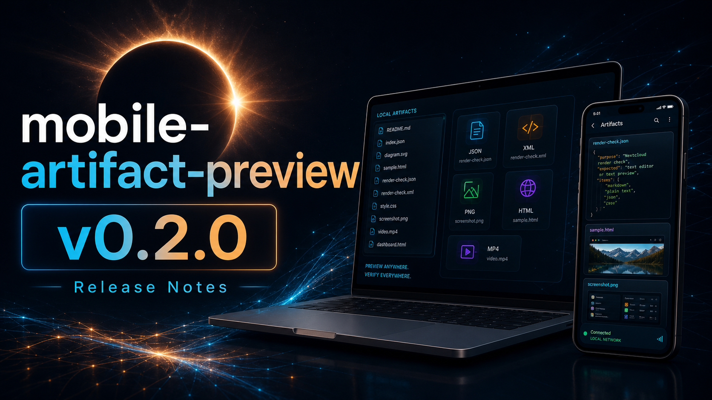

# Mobile Artifact Preview v0.2.0 Release Notes



Release date: 2026-06-08

v0.2.0 is a small release focused on release presentation and social sharing assets for `mobile-artifact-preview`.

The package itself remains the same mobile artifact preview skill and Nextcloud viewer introduced in v0.1.0. This release makes the public release surface cleaner: a dedicated v0.2.0 image-generated header, a reusable social thumbnail style, and a refreshed v0.1.0 header that matches the same visual system.

## ✨ Highlights

- Added a dedicated `v0.2.0` release header image with `mobile-artifact-preview` and `v0.2.0` rendered directly in the generated image.
- Added a reusable social thumbnail image style for release and article sharing.
- Refreshed the existing `v0.1.0` release header to use the same stronger social-thumbnail composition.
- Kept the generated release typography as image-generation output, with no post-generated text overlay.

## 🎨 Release Visual System

The new release header keeps the existing Mobile Artifact Preview identity:

- dark eclipse-style background;
- cyan and amber network accents;
- laptop and phone artifact preview surfaces;
- large readable repository name and version text;
- mobile-readable 16:9 composition for GitHub, note.com, and social cards.

The new files are:

```text
docs/images/release-header-v0.2.0.png
docs/images/release-header-v0.2.0-imagegen-direct.png
docs/images/social-thumbnail-v0.1.0.png
```

The v0.1.0 header files were also refreshed:

```text
docs/images/release-header-v0.1.0.png
docs/images/release-header-v0.1.0-imagegen-direct.png
```

## 📦 Package Scope

This release does not change the Nextcloud runtime, structured viewer behavior, Docker Compose setup, or Codex skill contract.

The v0.1.0 operating model remains current:

- return a clickable mobile-accessible link;
- include the local fallback path;
- verify the actual preview surface when possible;
- prefer the configured HTTPS Nextcloud route for phone-facing artifact links.

## ✅ Validation

Validated for this release:

```bash
./scripts/validate-package.sh
git diff --check
```

Additional checks:

- visually inspected `docs/images/release-header-v0.2.0.png`;
- confirmed the release range is `v0.1.0..HEAD`;
- verified that the shipped changes are limited to release visual assets and release documentation.

## 🧭 Known Scope

- This is a release-collateral update, not a viewer behavior release.
- Existing uncommitted logo-transparency experiment files are intentionally not included in v0.2.0.
- `v0.2.0` release images were generated with the repository name and version text baked into the image output.
